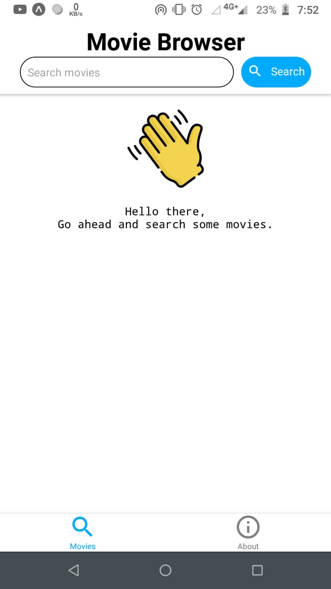
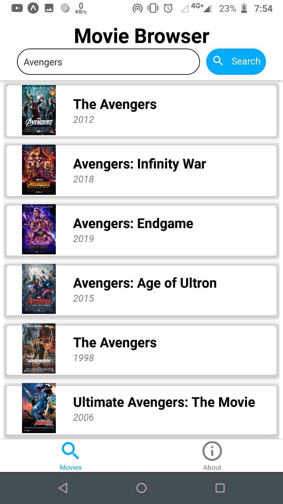
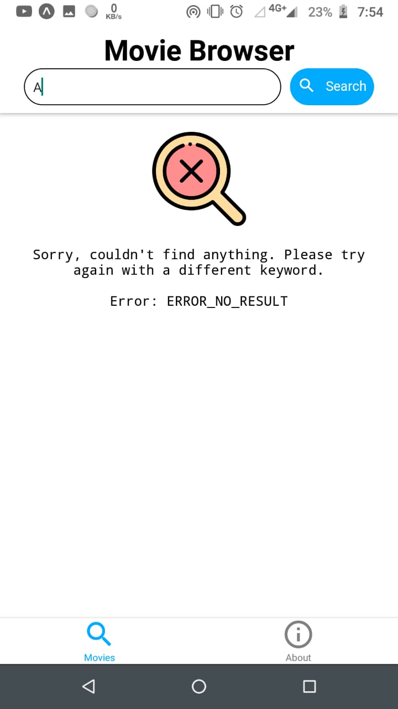

# Movie Browser

[](LICENSE)


**Movie Browser** is a React-Native App. It lets you search for a movie and look at the ratings, cast, director and brief plot of the movie.

Made with :heart: .

## API
I have used the [OMDb API](http://www.omdbapi.com/) for this app.
```
The Open Movie Database
The OMDb API is a RESTful web service to obtain movie information, all content and images on the site are contributed and maintained by our users.
```

# Screenshots

<table style="width:100%">
  <tr>
    <th>Home Screen</th>
    <th>Search Results</th>
    <th>Search Error</th>
  </tr>
  <tr>
    <td></td>
    <td></td>
    <td></td>
  </tr>
</table>

## Attributions

- Icons made by <a href="https://www.flaticon.com/authors/freepik" title="Freepik">Freepik</a> from <a href="https://www.flaticon.com/" title="Flaticon"> www.flaticon.com</a>

